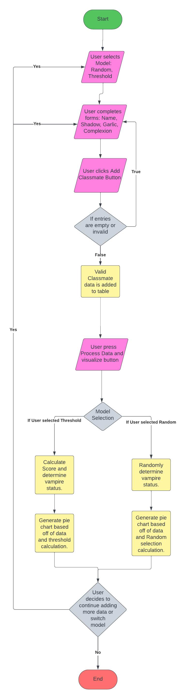

# Readme

## Team
```
Donald McLaughlin
Kyle Gemmill
Jonathan Motley

```
---
## Quick Start

1. Clone Repo
`$ git clone https://github.com/don1997/CSCI-4710-Group-2.git`
2. Go inside Project
`$ cd HW4`
3. Open with browser 
`$ firefox vampire.html`

## Or if using visual file manager
1. Clone Repo in terminal  
`$ git clone https://github.com/don1997/CSCI-4710-Group-2.git`
2. Navigate to cloned repository using file manager.
3. Go inside HW4 Folder.
4. Open `vampire.html` with your browser application. 
---
## Flow Chart

